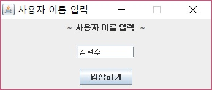

멀티스레드를 활용한 채팅 서버/클라이언트 프로그램
========================================

프로그램 개요
------------------
이 프로그램은 자바로 구성한 ...

기능 설명
-----------
기능은 다음과 같다..

보완할 점
----------
보완할 점은 다음과 같다...

실행 화면
------------
쓰인 기술엔 다음과 같다..

</img>

</img>

</img>

>123
>>12313

1. 123
2. 123
3. 12323

